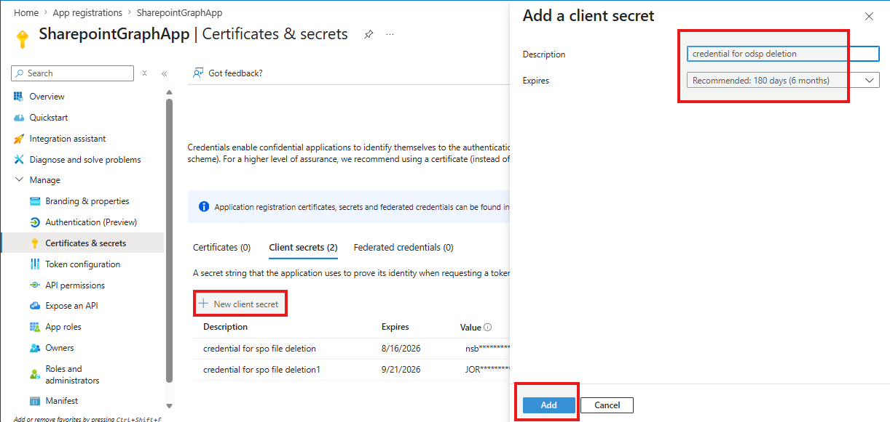
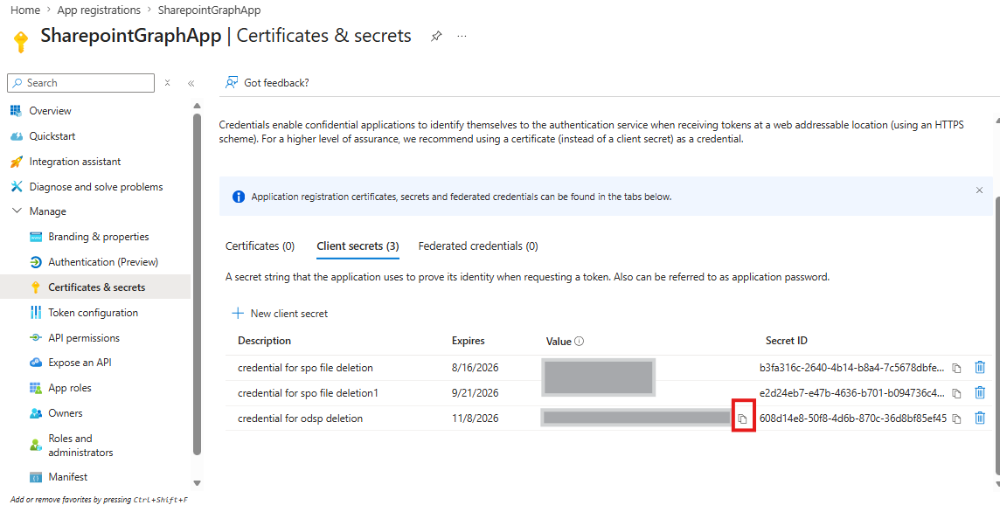

# SharePoint and OneDrive File Deletion Tool

A PowerShell script for batch deletion of files from SharePoint Online and OneDrive for Business using Microsoft Graph API.

## Overview

This tool is specifically designed for the SRR (Subject Right Request) deletion case. It facilitates the batch deletion of files from SharePoint Online and OneDrive for Business using Microsoft Graph API. The tool supports both SharePoint team sites and OneDrive personal libraries, ensuring compliance with SRR requirements.

## Prerequisites

- **PowerShell 5.1** or later
- **Azure AD Application** with the following:
  - Application (Client) ID
  - Client Secret
  - Tenant ID
  - API Permissions (Application permissions, admin consent required):
    - `Files.ReadWrite.All` — Required for permanent file deletion
    - `Sites.ReadWrite.All` — Required for resolving SharePoint site/drive info
    - `User.Read.All` — Required for resolving OneDrive drives by user email
    - `Sites.Seleted.All`

## Setting Up Azure AD Application

1. Navigate to [Azure Portal](https://portal.azure.com) / **Azure Active Directory** / **App registrations**
2. Click **New registration**
3. Provide a name (e.g., "SPO File Deletion Tool") and click **Register**
4. Note the **Application (client) ID** and **Directory (tenant) ID**
5. Go to **Certificates & secrets** / **New client secret** / Save the secret value

   

   > ⚠️ **Important:** After the secret is created, the secret **Value** will be displayed only once. Make sure to **copy and save it** immediately in a secure location — you will **not** be able to view it again after navigating away from this page.

   
6. Go to **API permissions** / **Add a permission** / **Microsoft Graph** / **Application permissions**
7. Add the following permissions:
   - `Files.ReadWrite.All`
   - `Sites.ReadWrite.All`
   - `Sites.Seleted.All`
   - `User.Read.All`
8. Click **Grant admin consent**

## Input File Format

Use the CSV file exported directly from eDiscovery export — no reformatting needed. The script reads the `Identifier` column from the exported CSV as-is.

### Supported URL Formats:

**SharePoint:**
```
https://{tenant}.sharepoint.com/sites/{site-name}/Shared Documents/{file-path}
https://{tenant}.sharepoint.com/sites/{site-name}/{library}/{file-path}
```

**OneDrive:**
```
https://{tenant}-my.sharepoint.com/personal/{user}_{domain}_{tld}/Documents/{file-path}
```

## Usage

### Basic Syntax

```powershell
.\DeleteODSPFile.ps1 `
    -DocumentLinksFile "C:\path\to\links.csv" `
    -TenantId "your-tenant-id" `
    -ClientId "your-client-id" `
    -ClientSecret "your-client-secret"
```

### Example

```powershell
.\DeleteODSPFile.ps1 `
    -DocumentLinksFile "C:\Exports\FilesToDelete.csv" `
    -TenantId "12345678-1234-1234-1234-123456789abc" `
    -ClientId "87654321-4321-4321-4321-210987654321" `
    -ClientSecret "your~secret~value~here"
```

### Using Variables

```powershell
$linksFile = "C:\Exports\FilesToDelete.csv"
$tenantId = "12345678-1234-1234-1234-123456789abc"
$clientId = "87654321-4321-4321-4321-210987654321"
$clientSecret = "your~secret~value~here"

.\DeleteODSPFile.ps1 `
    -DocumentLinksFile $linksFile `
    -TenantId $tenantId `
    -ClientId $clientId `
    -ClientSecret $clientSecret
```

## Execution Flow

1. **Authentication**: Retrieves an access token from Azure AD
2. **File Parsing**: Reads and validates document links from the CSV file
3. **Link Validation**: Filters out non-SharePoint/OneDrive URLs and empty entries
4. **Preview**: Displays all files to be deleted
5. **Warning**: Displays a permanent deletion warning in red
6. **Confirmation**: Requires typing "YES" to proceed (case-sensitive)
7. **Permanent Deletion**: Processes each file sequentially, permanently deleting via Graph API (bypasses Recycle Bin)
8. **Results Export**: Generates a detailed CSV report

## Output

### Console Output

```
==================================================
  Microsoft Graph Batch File Deletion Tool
==================================================

Retrieving access token...
? Access token retrieved successfully!

Reading document links from: C:\Exports\FilesToDelete.csv
Found 48 document link(s)

Document links to be deleted:
  1. https://contoso.sharepoint.com/sites/TeamSite/Shared Documents/file1.docx
  2. https://contoso-my.sharepoint.com/personal/user_contoso_onmicrosoft_com/Documents/file2.xlsx

Are you sure you want to PERMANENTLY delete ALL 48 file(s)? (YES to confirm): YES

Starting batch deletion...

[1/48] Processing:
  URL: https://contoso.sharepoint.com/sites/TeamSite/Shared Documents/file1.docx
  ? Deleted: file1.docx

[2/48] Processing:
  URL: https://contoso-my.sharepoint.com/personal/user_contoso_onmicrosoft_com/Documents/file2.xlsx
  ? Deleted: file2.xlsx

==================================================
  Batch Deletion Summary
==================================================
Total files processed: 48
Successfully deleted : 47
Failed to delete     : 1

Detailed report exported to: DeletionReport_20260219_143052.csv
```

### CSV Report

A timestamped CSV report is automatically generated with columns:
- **Index**: Sequential number
- **DocumentLink**: File URL
- **FileName**: Name of the deleted file
- **Status**: Success or Failed
- **Error**: Error message (if failed)

## Error Handling

The script handles common errors gracefully:

| Error Code | Description | Recommendation |
|------------|-------------|----------------|
| **423 Locked** | File is open or checked out | Close the file and retry |
| **404 Not Found** | File doesn't exist or URL is incorrect | The file may have already been deleted or no longer exists. Verify the URL or skip |
| **401 Unauthorized** | Invalid or expired token | Check app permissions and credentials |
| **403 Forbidden** | Insufficient permissions | Ensure app has `Files.ReadWrite.All`, `Sites.ReadWrite.All`, and `User.Read.All` |

## Security Considerations

**Important Security Notes:**

1. **Client Secret Protection**: Never commit client secrets to source control
2. **Confirmation Required**: Script requires explicit "YES" confirmation before deletion
3. **⚠️ Permanent Deletion**: Files are **permanently deleted** and **cannot be recovered**. This operation bypasses the Recycle Bin entirely.
4. **Least Privilege**: Use dedicated service account with minimal permissions
5. **Audit Logs**: All deletions are logged in Microsoft 365 audit logs as `FileDeleted`
6. **Quote Handling**: The script automatically strips surrounding double quotes from the `-DocumentLinksFile` path parameter

## Troubleshooting

### "No valid document links found in file"
- Ensure URLs start with `http://` or `https://`
- Verify URLs contain `sharepoint.com`
- Check that the file is not empty

### "Could not determine user email from URL"
- OneDrive URL format must be: `/personal/{user}_{domain}_{tld}/Documents/`

### "File not found (HTTP 404)"
- File may already be deleted
- URL might be incorrect or contain special characters
        
### Authentication failures
- Verify Tenant ID, Client ID, and Client Secret
- Ensure app permissions are granted and consented
- Check that the application is not expired

## Limitations

- Maximum API rate limits apply (Microsoft Graph throttling)
- Files must be accessible by the service account
- Does not support:
  - Files in Teams private channels (use Teams-specific permissions)
  - Files with retention policies preventing deletion       
  - Files locked by compliance features

## Best Practices

1. **Test First**: Run with a small CSV file (1-5 URLs) to verify configuration
2. **Backup**: Export file metadata before deletion
3. **Review Logs**: Check the output CSV report after execution
4. **Batch Size**: For large datasets (>1000 files), split into multiple CSV files
5. **Monitor**: Review Microsoft 365 audit logs for deletion events

## Files

- `DeleteODSPFile.ps1` - Main PowerShell script
- `README.md` - This documentation file

## Support

For issues or questions:
- Check Microsoft Graph API documentation: https://learn.microsoft.com/graph/api/driveitem-permanentdelete
- Review Azure AD app permissions: https://learn.microsoft.com/graph/permissions-reference
---

**Version**: 1.1  
**Last Updated**: May 2026  
